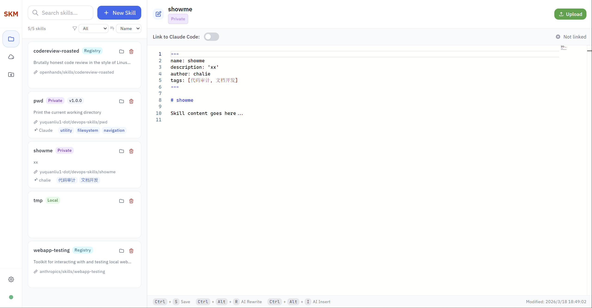
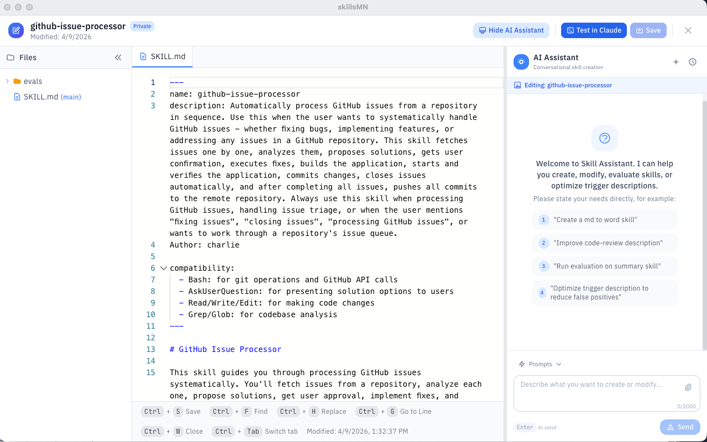
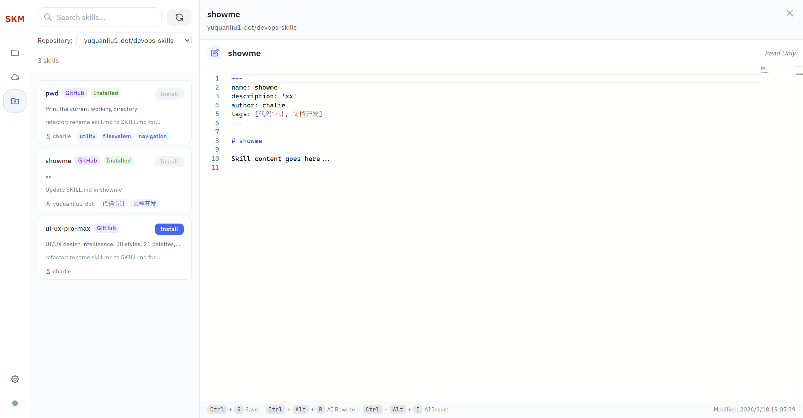
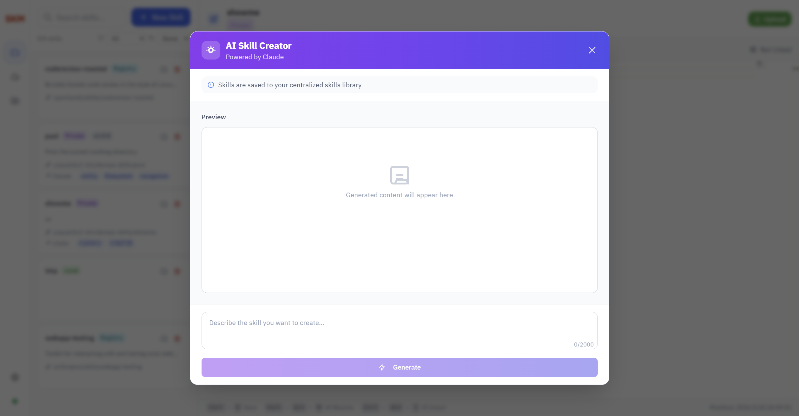

# skillsMN

<div align="center">

**技能管理中心**

*一款全面的桌面应用程序，用于管理、发现和分享技能*

[](https://opensource.org/licenses/MIT)
[](https://nodejs.org/)
[](https://www.electronjs.org/)

[English](#features) | [简体中文](#功能特性) | [文档](#文档) | [贡献](#贡献指南)

</div>

---

## 🎯 功能特性

skillsMN 是一款基于 Electron 的桌面应用程序，为用户提供统一的界面来：

- 📁 **管理本地技能** - 在项目和全局目录中创建、编辑、删除和组织技能
- 🤖 **AI 辅助生成** - 使用自然语言生成或修改技能，支持实时流式输出
- 🔍 **发现公共技能** - 从 GitHub 和 skills.sh 注册表搜索社区技能
- 🌐 **技能注册表搜索** - 即时搜索数千个精选技能，一键安装
- 🔒 **私有仓库同步** - 连接私有 GitHub 仓库进行团队技能共享，支持更新检测
- ⚡ **实时同步** - 文件更改时自动检测和更新 UI
- 📝 **Monaco 编辑器** - 功能齐全的代码编辑器，支持语法高亮
- 🎨 **现代界面** - 简洁的深色模式界面，响应式设计

## 📸 软件截图

<div align="center">

### 主界面

*简洁的深色模式界面，技能管理一目了然*

### 技能编辑器

*Monaco 编辑器，支持语法高亮编辑技能*

### 注册表搜索

*从 skills.sh 注册表搜索并安装技能*

### AI 生成

*使用自然语言通过 AI 辅助生成技能*

</div>

## 🚀 快速开始

### 环境要求

- **Node.js** v20.x 或更高版本 - [下载](https://nodejs.org/)
- **npm** v10.x 或更高版本（随 Node.js 一起安装）
- **操作系统**: Windows 10/11, macOS 12+, 或 Linux Ubuntu 20.04+

### 安装步骤

```bash
# 克隆仓库
git clone https://github.com/yourusername/skillsMN.git
cd skillsMN

# 安装依赖
npm install

# 构建应用
npm run build

# 启动应用
npm start
```

### 首次设置

首次启动 skillsMN 时：

1. **设置对话框** - 选择您的 Claude 项目目录
2. **选择目录** - 浏览并选择包含 `.claude/skills` 文件夹的目录
3. **开始管理** - 您的技能将被加载并显示

## 💡 核心功能

### 📁 技能管理

**创建技能**
1. 点击 **"Create Skill"**（或按 `Ctrl+N`）
2. 输入技能名称并选择目录（项目/全局）
3. 在 Monaco 编辑器中编辑，支持语法高亮
4. 按 `Ctrl+S` 保存

**编辑与删除**
- 双击任意技能进行编辑
- 选中技能后按 `Delete` 删除（移至回收站）
- 实时文件监控保持 UI 同步

**目录结构**
```
skill-name/
├── skill.md          # 带有 YAML 前置数据的主技能文件
├── example.txt       # 可选资源文件
└── data.json         # 可选数据文件
```

### 🔍 注册表搜索（新功能！）

从 [skills.sh](https://skills.sh) 注册表搜索和安装技能：

1. **搜索** - 在 Registry 标签页输入关键词（400ms 防抖）
2. **浏览** - 查看技能名称、描述、安装次数
3. **安装** - 一键安装，带进度跟踪
4. **追踪** - 已安装技能包含源元数据

<details>
<summary><b>📖 安装进度</b></summary>

- 10% - 克隆仓库（浅克隆，depth=1）
- 40% - 查找技能目录
- 60% - 复制文件
- 80% - 写入元数据
- 90% - 清理
- 100% - 完成
</details>

### 🤖 AI 辅助生成

使用自然语言生成或修改技能：

1. 点击 **"Generate with AI"**
2. 用通俗语言描述您的技能
3. 观看 AI 实时生成内容（200ms 流式输出）
4. 编辑并保存生成的技能

### 🔒 私有仓库管理

连接私有 GitHub 仓库进行团队共享：

<details>
<summary><b>⚙️ 设置私有仓库</b></summary>

1. 打开 **Settings** → **Repositories** 标签
2. 点击 **"Add Repository"**
3. 输入仓库 URL（例如：`https://github.com/your-org/team-skills`）
4. 提供具有 `repo` 范围的 GitHub PAT
5. 自动测试连接

**创建 GitHub PAT：**
- 访问 GitHub.com → Settings → Developer settings → Personal access tokens
- 生成新令牌（classic），选择 `repo` 范围
- 复制并粘贴到 skillsMN

**安全性：**
- PAT 使用 Electron safeStorage 加密（平台特定）
- Windows: DPAPI | macOS: Keychain | Linux: Secret Service API
- 永远不会暴露给渲染进程
</details>

**功能特性：**
- 浏览带元数据的技能（最后提交、文件数量）
- 更新检测，带视觉徽章
- 冲突解决（覆盖/重命名/跳过）
- 自动 5 分钟缓存

## ⌨️ 键盘快捷键

| 快捷键 | 操作 |
|----------|--------|
| `Ctrl+N` | 创建新技能 |
| `Ctrl+S` | 保存当前技能 |
| `Ctrl+W` | 关闭编辑器 |
| `Delete` | 删除选中的技能 |
| `Escape` | 关闭对话框/编辑器 |

## 🏗️ 技术架构

使用现代技术构建：

- **Electron** - 跨平台桌面框架
- **React 18** - UI 组件
- **TypeScript 5** - 类型安全开发
- **Tailwind CSS** - 实用优先的样式
- **Monaco Editor** - VS Code 的编辑器组件
- **Chokidar** - 文件系统监控
- **Jest & Playwright** - 测试框架

### 项目结构

```
skillsMN/
├── src/
│   ├── main/              # Electron 主进程
│   │   ├── models/        # 数据模型
│   │   ├── services/      # 业务逻辑
│   │   ├── ipc/           # IPC 处理程序
│   │   └── utils/         # 工具函数
│   ├── renderer/          # Electron 渲染器（UI）
│   │   ├── components/    # React 组件
│   │   ├── services/      # 客户端服务
│   │   └── styles/        # CSS 样式
│   └── shared/            # 共享类型
├── tests/                 # 测试文件
│   ├── unit/             # 单元测试
│   ├── integration/      # 集成测试
│   └── e2e/              # E2E 测试（Playwright）
└── specs/                # 功能规范
```

## 🛠️ 开发指南

### 可用脚本

```bash
npm start              # 启动应用
npm run build          # 构建 TypeScript 和渲染器
npm test               # 运行所有测试
npm run test:unit      # 运行单元测试
npm run test:e2e       # 运行 E2E 测试
npm run lint           # 运行 ESLint
npm run dist           # 创建生产构建
```

### 测试

```bash
# 运行所有测试
npm test

# 使用 Playwright 运行 E2E 测试
npm run test:e2e

# 运行性能测试
node tests/performance/test-performance.js

# 运行安全测试
node tests/security/test-path-validator.js
```

### 调试

**主进程：**
```bash
npm start -- --inspect
```

**渲染器进程：**
- 打开开发者工具：`Ctrl+Shift+I` 或 `F12`

## 📊 性能

针对速度和效率进行了优化：

- **启动时间**：500 个技能 <3 秒
- **列表加载**：500 个技能 ≤2 秒
- **实时更新**：<500ms 文件更改检测
- **CRUD 操作**：每次操作 <100ms
- **内存使用**：500 个技能 <300MB
- **CPU 使用率**：空闲时 <5%

## 🔐 安全性

强大的安全实现：

- ✅ 路径验证防止目录遍历攻击
- ✅ 仅允许访问已授权目录的沙盒文件
- ✅ 安全删除（回收站，非永久删除）
- ✅ 无远程代码执行（无 eval()）
- ✅ 加密的凭据存储（平台特定）

## 📖 文档

- **功能规范**：`specs/` 目录包含详细规范
- **API 文档**：查看内联 JSDoc 注释
- **性能测试**：`specs/002-local-skill-management/performance-tests.md`
- **安全测试**：`specs/002-local-skill-management/security-tests.md`

## 🤝 贡献指南

我们欢迎贡献！请遵循以下步骤：

1. Fork 本仓库
2. 创建功能分支（`git checkout -b feature/amazing-feature`）
3. 提交更改（`git commit -m 'feat: add amazing feature'`）
4. 推送到分支（`git push origin feature/amazing-feature`）
5. 打开 Pull Request

### 提交规范

我们遵循 [Conventional Commits](https://www.conventionalcommits.org/)：

- `feat:` 新功能
- `fix:` 错误修复
- `docs:` 文档更改
- `test:` 测试添加/更改
- `refactor:` 代码重构
- `chore:` 维护任务

## 📝 许可证

本项目采用 MIT 许可证 - 详情请查看 [LICENSE](LICENSE) 文件。

## 🙏 致谢

- 使用 [Electron](https://www.electronjs.org/) 构建
- UI 由 [React](https://react.dev/) 和 [Tailwind CSS](https://tailwindcss.com/) 驱动
- 编辑器由 [Monaco](https://microsoft.github.io/monaco-editor/) 提供
- 文件监控由 [Chokidar](https://github.com/paulmillr/chokidar) 实现

## 💬 支持

- **文档**：查看 `specs/` 目录
- **问题反馈**：通过 [GitHub Issues](https://github.com/yourusername/skillsMN/issues) 报告错误
- **讨论**：加入 [GitHub Discussions](https://github.com/yourusername/skillsMN/discussions)

---

<div align="center">

**用 ❤️ 为 Claude Code 社区打造**

</div>
